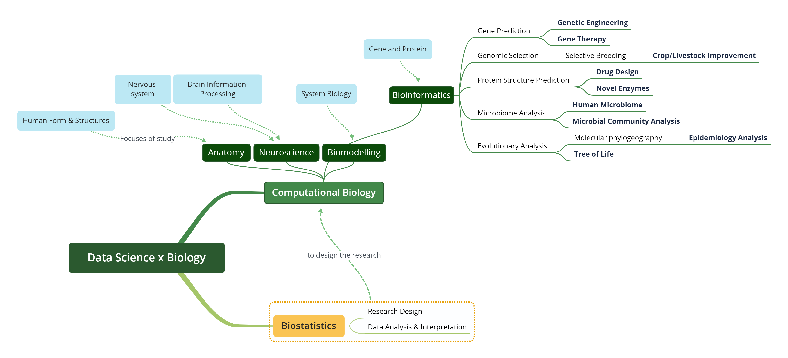
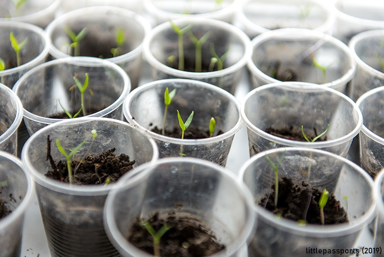
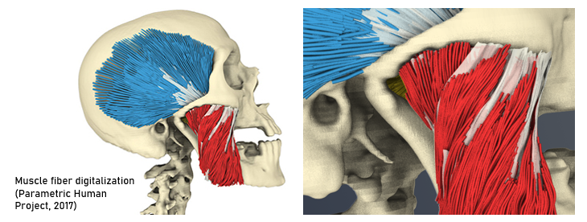
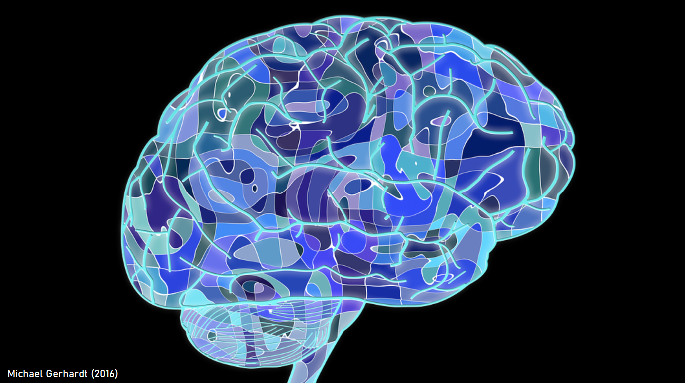
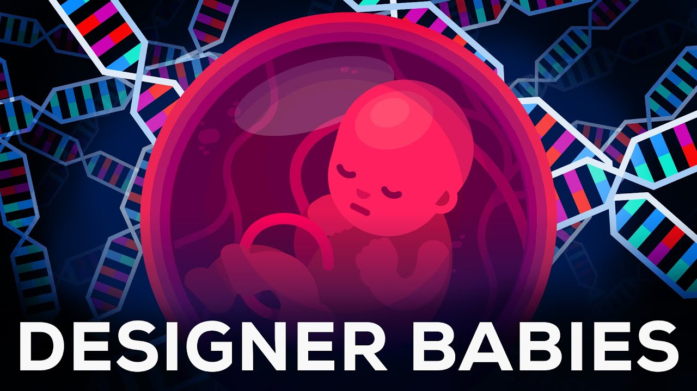
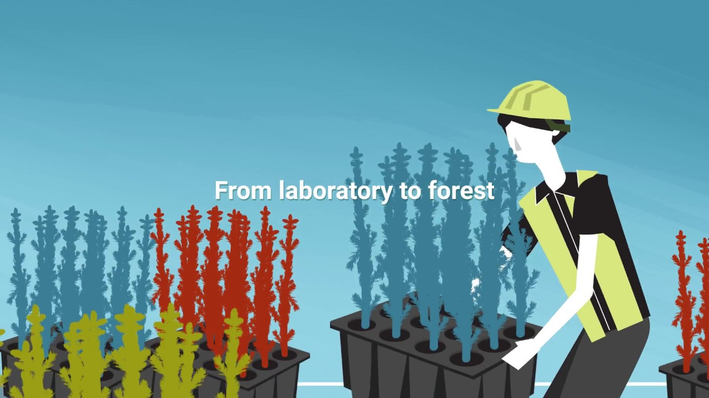
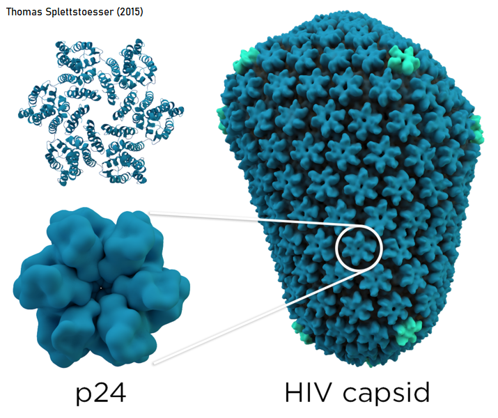
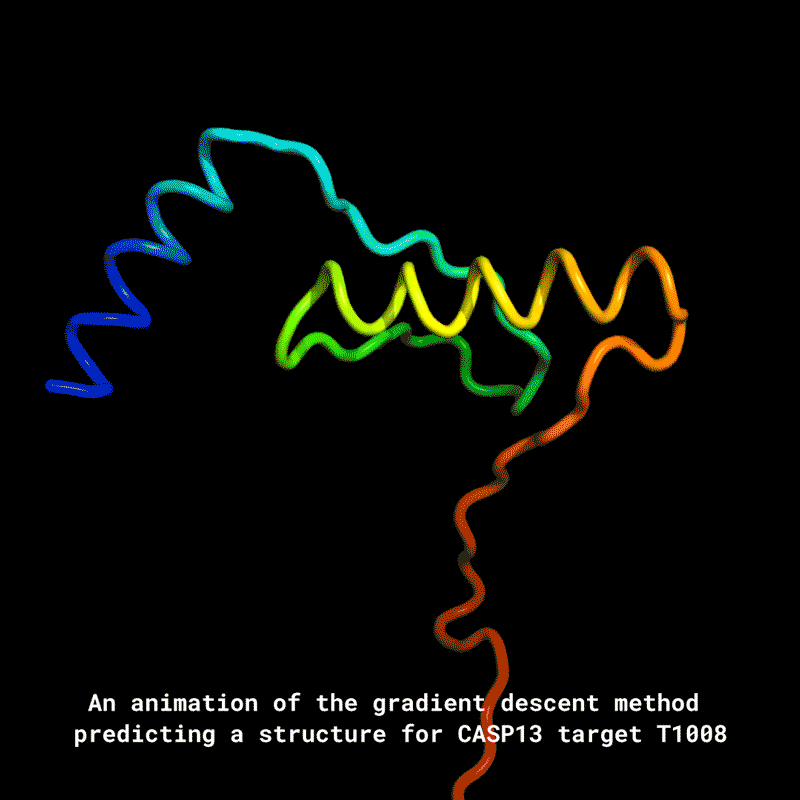
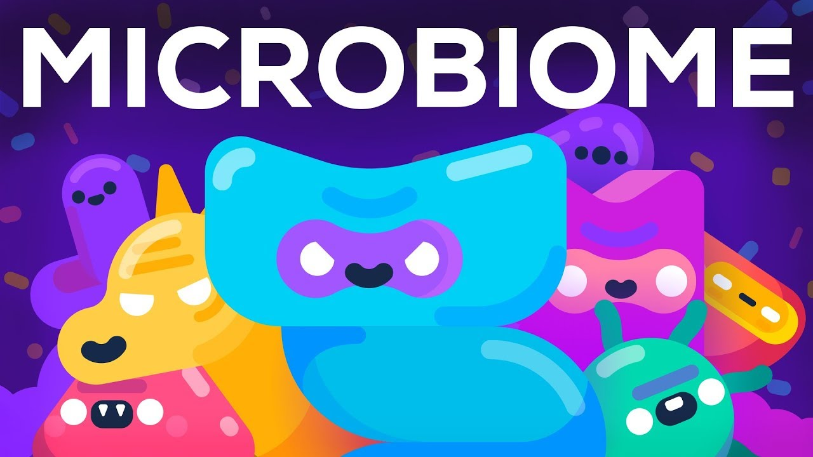
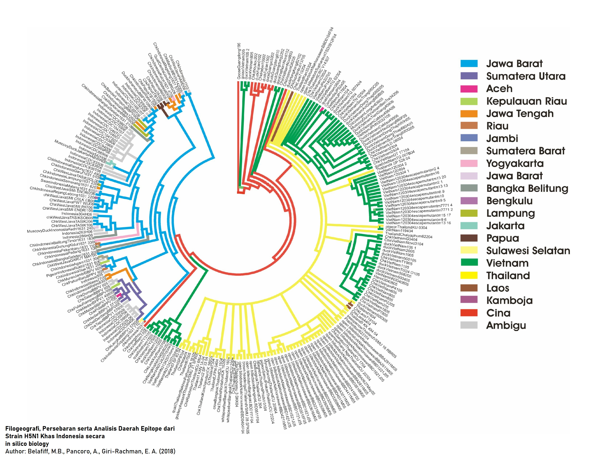

# BioxMap

is Mind Map for the specialization of **Data Science x Biology**, to help you (and I, of course) explore this wide field of study. 

The map were made and published on **16 Dec 2019**, and summarize most of the discussed topics about Data Science x Biology that day. Later, this map will continue to be updated for the latest news an development in Data Science x Biology. Stay tune and happy exploring!

## Explore Further but Don't Get Lost!

From my previous article, ["Bioinformatics: Decoding Nature's Code of Life"](https://algotech.netlify.com/blog/bio-intro/), we have discussed briefly about **Bioinformatics**, the buzz word when we talk about **Data Science x Biology**. We have learned the basic knowledge and try some practical case. Even so, there is so much more to explore!

To help you explore this wide field of study, I have prepared a map that describes **various topics** inside *Data Science x Biology*. Below you will also find keywords and its description that hopefully helps you to do research about that specific topic, added with some **example uses** and **further reading**.

## The Map

Introducing **BioxMap**! A map on various fields related to the integration of Data Science with Biology.

There are 2 main topics when we talk about Data Science x Biology:

**Biostatistics** focuses on the preparation and research design of an experiment 

**Computational Biology** encompasses all biological areas that involve computation, such as modeling of an ecosystem, population dynamics, etc. 

Computational Biology can be divided into several sub-topics based on research interest (marked in blue). Even so, those topics can intertwine in practice, mainly because of the complexity of biological systems and phenomena. *Bioinformatics* is actually one sub-topic inside computational biology. I have diveded its branches for more in-depth look into bioinformatics sub-topic and application (for I am more familiar with the topic).

Below are the more detailed descriptions of each topic and what's inside.

## Biostatistics 

Biostatistics is the development and application of statistical methods to a wide range of topics in biology. It encompasses the **design of biological experiments, the collection and analysis of data** from those experiments and the interpretation of the results. 

This field is almost the same with statistics but using biological data for analysis. Biostatistics acts as **a solid foundation** to build a biological research whereas we collect reliable data.

In general biological experiment, the data that were analyzed is usually more easy to interpret than what it is in Computational Biology. The Data can be from **agricultural** or **fisheries** related experiment to analyze the performance of specific treatment for improving crops/fisheries/livestock production. The data may include quality of farm product along with its measured enviromental data such as humidity, soil nutrient content, watering frequency, etc.

Data scientist play important role in analyzing these data through machine learning and various methods to provide better decision making. The measured characteristic (phenotype) data can also be combined with genotype data (more specific biological data such as DNA sequence and gene expression) that may improve the model performance. An article from BAYER is a great coverage about how Data Science may improve crop production[^1].

## Computational Biology

Computational Biology encompasses **all biological areas that involve computation**. It is the science of using biological data to develop algorithms or models to understand biological systems and relationships. This topic can be further divided into several subtopics. 

### Computational Anatomy 

Computational Anatomy is the use of geometric- and statistics-based mathematical techniques to analyze and understand the variation in **human form and structure**[^2]. This sub-topic highly uses the data derived from sensor imaging modalities such as Magnetic Resonance Imaging (**MRI**). Some focuses on this topic include:

* identify differences in brain shape and connectivity that differentiate patient with a mental disorder or who is facing neuro-developmental diseases (brain development impairments),

* shape and motion changes in heart-related to heart diseases,

* tumor shape changes to characterize the progression of cancer,

* research on the muscle architecture to provide a better understanding of muscular pain and better surgery practices, etc.

Below are some further readings regarding this topic:

[Muscle Fiber digitalization (Parametric Human Project)](https://parametrichuman.org/discovers/university-of-toronto/)

[Computational Anatomy](https://icm.jhu.edu/research-areas-2/computational-anatomy/)

[Automated Machine Learning in Brain Predictive Modelling: A data-driven approach to Predict Brain Age from Cortical Anatomical Measures](https://www.researchgate.net/publication/335435797_Automated_Machine_Learning_in_Brain_Predictive_Modelling_A_data-driven_approach_to_Predict_Brain_Age_from_Cortical_Anatomical_Measures)

### Computational Neuroscience 

Computational Neuroscience is the field of study in which mathematical tools and theories are used to investigate brain function in order to understand how the **nervous system processes information** [^3]. 

Discussion around this topic is still highly focused on the research rather than for practical application. Scientists are still developing a way to tackle the enormous data they acquire from this topic. Even so, this topic is still very interesting because it is what inspires the development of Neural Networks. Many of the algorithms and models of Neural Networks/Computer Visions are derived from the theoretical understanding of neuroscience. Below are some good readings if you want to know more about this topic:

[Intuition in silico: How Ideas From Computational Neuroscience Help Programmers Build Smarter Computers](http://sitn.hms.harvard.edu/flash/2016/intuition-in-silico-how-ideas-from-computational-neuroscience-help-programmers-build-smarter-computers-2/)

[A Brief Introduction to Computational Neuroscience Part 1](https://towardsdatascience.com/a-brief-introduction-to-computational-neuroscience-part-1-42171791f613)

[Neuroscience: Big Brain, Big Data](https://www.scientificamerican.com/article/neuroscience-big-brain-big-data/)

### Computational Biomodeling 

Computational Biomodeling is the use of computers to simulate and study the behavior of complex **biological systems**. Research around this includes:

* modeling of blood vessels & heart valves to better treatment cardiovascular disease,

* modeling of the human cornea to help stimulate laser eye surgery and refine the technique,

* modeling the drug delivery compatibility to help design drugs, to know which drugs have a least likely adverse side effects to the patient, etc. 

Below are further readings around this topic:

[Computational Modeling](https://www.nibib.nih.gov/science-education/science-topics/computational-modeling)

[Computational Bio-Modeling Lab](https://www.meche.engineering.cmu.edu/faculty/zhang-computational-bio-modeling-lab.html)

[Bio-Modeling System](https://www.bmsystems.net/)

## Bioinformatics 

**Bioinformatics** a.k.a **Computational Genomics** is an interdisciplinary field that develops methods and software tools for understanding biological data which is limited to sequence, structural, and functional analysis of **genes/DNA**. Although it focuses on analyzing gene information, research around this topic applies to many other sub-topic and industry. This is because the basic information on living things is contained in their DNA. 

Common uses of bioinformatics include the identification of candidates genes. Such identification is made with the aim of better understanding the genetic basis of disease, unique adaptations, desirable properties (esp. in agricultural species), or differences between populations. Below are some famous research around Bioinformatics.

#### **Gene Prediction** 

Gene Prediction aims to *identifies & locates specific gene which encodes features/characteristics* such as diseases and traits. Information obtained from this research can later be used for the development of **genetic engineering** and **gene therapy**. Gene therapy is an experimental technique that uses genes to treat/prevent disease. For example, by replacing a mutated gene that causes disease with a healthy copy of the gene. Along with the increase of routinely collected data, data scientists can also help classify which patient is appropriate for clinical trials, develop **personalized medicine/treatments**, and so much more.

Below is further reading about this topic and an interesting video about the future of gene therapy and genetic engineering:

[Data Science Enabling Personalized Medicine](https://bmcmedicine.biomedcentral.com/articles/10.1186/s12916-018-1122-7)

[The Growing Role of Data Scientists and Analysts in Gene Therapy](https://towardsdatascience.com/the-growing-role-of-data-scientists-and-analysts-in-gene-therapy-9c5a04b63be4)

[**Genetic Engineering Will Change Everything Forever - CRISPR**](https://www.youtube.com/watch?v=jAhjPd4uNFY)

#### **Genomic Selection** 

Single-nucleotide Polymorphism (**SNPs**) is a mutation of a single nucleotide that occurs at a specific position in the genome. This mutation can associate with higher/lower susceptibility to diseases, specific traits, etc.

SNP is now being researched for **Genomic Selection** in **Selective Breeding** for crops/livestock improvement.  Selective breeding is a method to *select crops/livestock breeds based on their traits*. The potential organism with desired traits such as crops with higher nutrients and have high resistance against diseases is preselected to grow in the field. Using genomic selection, the selection process can be more rapid and therefore save a great amount of time and budget. This result in higher productivity rather than using conventional process that has to wait for the crops to be fully developed or ready to harvest.

Below are some further readings and a video about this topic:

[The Usage of Genomic Selection Strategy in Plant Breeding](https://www.intechopen.com/books/next-generation-plant-breeding/the-usage-of-genomic-selection-strategy-in-plant-breeding)\

[Genomic selection: Break-through technology to make selective breeding more effective](https://www.luke.fi/aquaimpact/2019/06/05/genomic-selection-break-through-technology-to-make-selective-breeding-more-effective/)

[Genomic Prediction of Breeding Values Using a Subset of SNPs Identified by Three Machine Learning Methods](https://www.frontiersin.org/articles/10.3389/fgene.2018.00237/full)

[**Forest Genetics - Genomic Selection**](https://www.youtube.com/watch?v=X7DADlgWdG8)

#### **Protein Structure Prediction**

Protein Structure Prediction is the *prediction of a Protein 3D structure* which is highly important in **drug design** and the design of **novel enzymes**. This case is highly used in drug design where the protein we want to predict is a protein that responsible for diseases, for example a protein from Influenza or HIV virus. This prediction is important because when the protein structure is known, one can predict its function and which drugs can efficiently bind to 'knock-off' the protein. 

Every two years since 1994, the performance of current methods of protein structure perediction is assessed in the **CASP** (Critical Assessment of protein Structure Prediction), a community-wide, worldwide experiment for protein structure prediction. In December 2018, CASP13 made headlines when it was won by **AlphaFold**, an **artificial intelligence program** created by **DeepMind**. Below is the animation of the protein predicted.

Below is the link for further readings:

[AlphaFold: Using AI for scientific discovery](https://deepmind.com/blog/article/alphafold)

[Protein Sequence Classification](https://towardsdatascience.com/protein-sequence-classification-99c80d0ad2df)

#### **Microbiome Analysis**

Microbiome Analysis is the *analysis of  a community of microorganisms* (such as bacteria, fungi, and viruses) that inhabit a particular environment. Research on **human microbiome** is in the hype lately because it is said that our those microbes might be affecting our weight, can relate to obesity, our brain, our health, and many more.

This microbiome analysis is also very powerful for environmental study. This study answers questions such as, "What community of microbes lives in a polluted river? Can we develop a biomarker for polluted/unpolluted river? What kinds of bacteria live in the community's drinking water system? What promotes the growth of pathogenic bacteria in a drinking water systems?", and many more.

Below are further readings and an interesting videos about this topic:

[The human microbiome: why our microbes could be key to our health](https://www.theguardian.com/news/2018/mar/26/the-human-microbiome-why-our-microbes-could-be-key-to-our-health)

[Reproducible, interactive, scalable and extensible microbiome data science using QIIME 2](https://www.nature.com/articles/s41587-019-0209-9)

[**How Bacteria Rule Over Your Body - The Microbiome**](https://www.youtube.com/watch?v=VzPD009qTN4)

#### **Evolutionary Analysis**

Evolutionary Analysis is the study of the *evolutionary history and relationships among individuals* or groups of organisms (e.g. species, or populations) by their DNA. This study help us in many field:

* map the origin of pathogens for epidemiological analysis using their anchestral relationship (phylogeography),

* building a tree of life to identify unknown species based on similarity of DNA with known species,

* narrow potential organism with specific traits based on the similarity of DNA with known species, etc.

You can read more about the third application in evolutionary analysis in our first article about [Bioinformatics](https://algotech.netlify.com/blog/bio-intro/). Meanwhile, further readings about this topic are below:

[Phylogeographic reconstruction using air transportation data and its application to the 2009 H1N1 influenza A pandemic](https://www.biorxiv.org/content/10.1101/666982v1.full)

[Molecular Phylogenetics using Bio.Phylo](https://towardsdatascience.com/molecular-phylogenetics-using-bio-phylo-57ce27492ee9)

Those are the topics that summarize most of the discussed topics today about Data Science x Biology. Later, this map will be continue to be updated for the latest news an development in Data Science x Biology. Stay tune and happy exploring!

# References 

[^1]: Bayer. *How Math and Data Science Accelerate Innovation While Conserving Resources* [Online] https://www.cropscience.bayer.com/en/stories/2019/molecular-math-data-science-accelerate-innovation-plant-breeding, accessed 10th December 2019

[^2]: Autodesk Research. *Computational Anatomy and Biomechanics* [Online] https://www.autodeskresearch.com/projects/computational-anatomy, accessed 10th December 2019

[^3]: Nature Research. *Computational Neuroscience* [Online] https://www.nature.com/subjects/computational-neuroscience, accessed 10th December 2019
